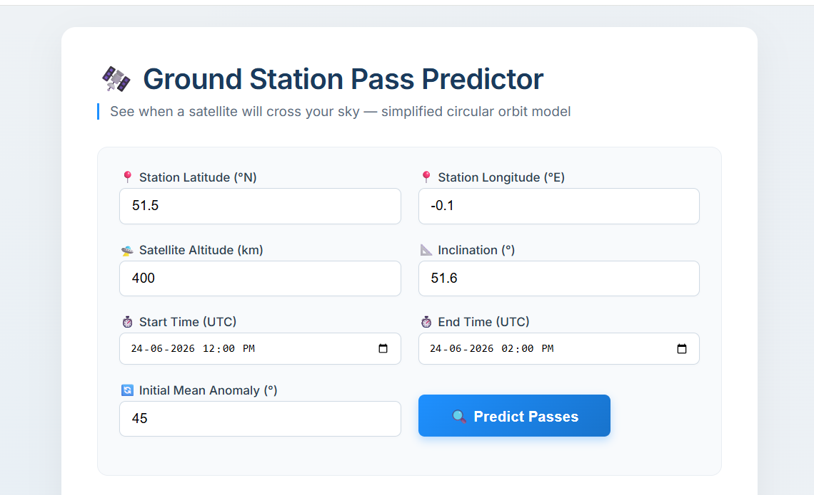
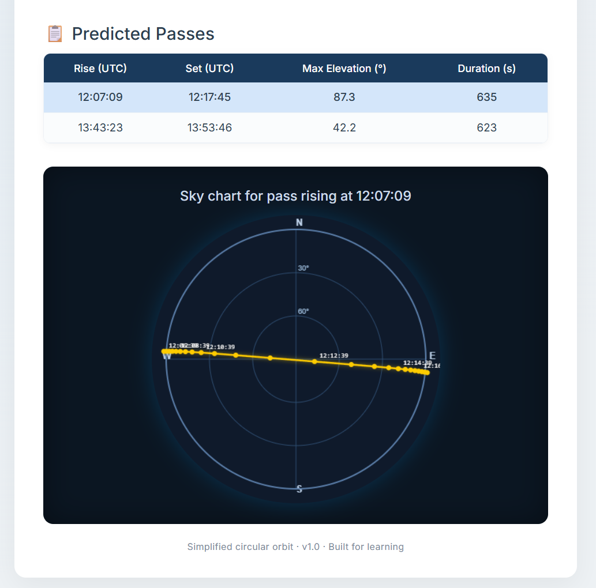

# 🛰️ Ground Station Pass Predictor

Predict when a satellite is visible from a ground station using a simplified circular orbit model.

---

## Why I Built This

I'm a 2nd year B.Tech AI & Data Science student exploring orbital mechanics and full-stack development. This project helped me understand:

- How satellite orbits work (circular two-body problem)
- Coordinate transformations: ECI → ECEF → topocentric
- Building a Flask web app with an interactive UI
- Displaying scientific data with a polar sky chart using JavaScript Canvas

---

## What It Does

- Input a ground station location (lat/lon), satellite altitude, inclination, time window, and initial mean anomaly
- Calculates all visible passes (when satellite is above the horizon)
- Displays rise time, set time, max elevation, and pass duration
- Shows an interactive polar sky chart — click any pass to see the satellite's track across your sky

---

## Tech Stack

| Layer | Technology |
|---|---|
| Backend | Python 3, Flask |
| Orbital math | Pure Python (standard library only) |
| Frontend | HTML5, CSS3, Vanilla JavaScript |
| Sky chart | HTML Canvas (polar plot) |
| Styling | Custom CSS, Google Fonts (Inter) |

No external APIs. No databases. No build tools. Just Python and a browser.

---

## How to Run Locally

**1. Clone the repository**

```bash
git clone https://github.com/devamayookha/ground-station-pass-predictor.git
cd ground-station-pass-predictor
```

**2. Install Flask**

```bash
pip install flask
```

**3. Run the app**

```bash
python app.py
```

**4. Open your browser**
http://127.0.0.1:5000

---

## Screenshots




---

## How the Model Works

- Circular orbit around a spherical Earth
- Earth radius: 6371 km, μ = 398600.44 km³/s²
- Satellite position: orbital plane → ECI frame
- GMST rotation: ECI → ECEF
- Ground station in ECEF → azimuth and elevation
- Pass detected when elevation crosses 0°

---

## Project Structure
ground_station_predictor/
├── app.py
├── orbit_model.py
├── requirements.txt
├── Procfile
├── .gitignore
├── README.md
└── screenshots/
    └── screenshot.png

---

## Version 2 Ideas

- Real TLE data + SGP4 propagator
- Multiple satellite support
- Ground track on world map
- CSV/PDF export
- Local timezone support

---

## About

Built as part of an AI × Space Technology portfolio series.


## 👤 Author

**B.R Devamayookha** – 2nd-year B.Tech AI & Data Science student (Sona College Of Technology)

[GitHub](https://github.com/devamayookha) • [LinkedIn](https://linkedin.com/in/b-r-devamayookha-627305375) 

Educational project — free to use and modify.